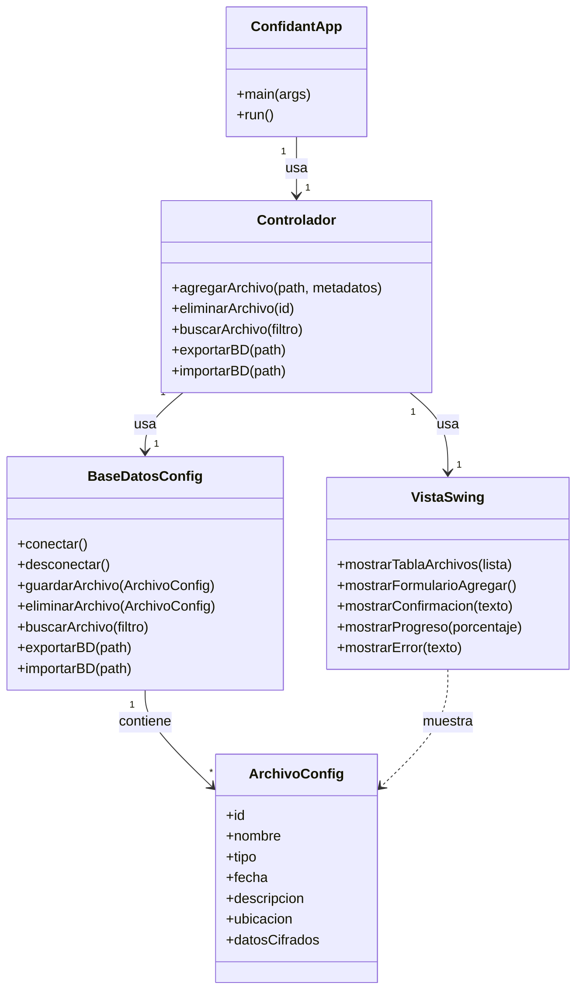

# **Scrum aplicado a Confidant**

* Proyecto: **Confidant**
* Tecnología: **Java, Swing, JPA, SQLite**
* Metodología: **Scrum**
* Nota: **PO + SM + Dev** Único, Scrum ligero para una sola persona.

---

## **Pre-Sprint 0: Preparación y Product Backlog Inicial (Día 1 - 3)**

**Actividad principal:**

* Definir alcance del MVP.
* Crear repositorio GitHub y configurar Maven/Gradle, GitHub Actions (compilación/pruebas), Issues y Projects.
* Esbozar arquitectura:

  * Modelo: clases de archivos y metadatos, persistencia con JPA + SQLite.
  * Vista: Swing con JTable para gestión de archivos.
  * Controlador: operaciones CRUD, cifrado y exportación/importación.

### Análisis del Dominio

**Product Backlog inicial (priotizado):**

1. **HU1**: Como usuario, quiero agregar archivos a la base de datos con metadatos (nombre, fecha, descripción, ubicación, tipo).
2. **HU2**: Como usuario, quiero que los archivos se guarden cifrados para seguridad.
3. **HU3**: Como usuario, quiero buscar y filtrar archivos por nombre, tipo o fecha.
4. **HU4**: Como usuario, quiero eliminar archivos de la base de datos de manera segura.
5. **HU5**: Como usuario, quiero exportar la base de datos cifrada para usarla en otra computadora.
6. **HU6**: Como usuario, quiero importar una base de datos cifrada para restaurar archivos y metadatos.
7. **HU7**: Como desarrollador, quiero pruebas unitarias para asegurar la persistencia y el cifrado de archivos.
8. **HU8**: Como usuario, quiero ver confirmaciones y progreso en la interfaz gráfica al añadir, cifrar, exportar o importar archivos.

Para más información y detalles consulte [Product Backlog](/Documentacion-Desarrollo/ProductBacklog.md)

---

### Diseño Estático Inicial

* Lenguaje: Java
* Sistema Operativo: Multiplataforma (Windows, Linux, macOS)
* Arquitectura: Modelo Vista Controlador (MVC)

**Diagrama de Clases Inicial (MVP)**



---

#### Explicación de cada componente y su interacción

##### 1. **ConfidantApp**

* Clase principal, punto de entrada de la aplicación.
* Contiene `main` que inicia el **Controlador** y la **Vista**.

##### 2. **Controlador**

* Orquesta la lógica de la aplicación.
* Gestiona operaciones CRUD sobre archivos, cifrado y exportación/importación de base de datos.
* Comunica resultados y errores a la **VistaSwing**.

##### 3. **Modelo**

* **ArchivoConfig**: representa un archivo con metadatos y contenido cifrado (BLOB).
* **BaseDatosConfig**: maneja la conexión a SQLite mediante JPA, persistencia de archivos y operaciones de exportación/importación.

##### 4. **VistaSwing**

* Interfaz gráfica con JTable para mostrar archivos.
* Formularios para agregar/editar archivos y metadatos.
* Barras de progreso y mensajes de confirmación/errores.

---

#### Flujo general de interacción

1. El usuario inicia **ConfidantApp**.
2. **Controlador** inicializa la conexión a la base de datos y carga la lista de archivos.
3. La **VistaSwing** muestra los archivos existentes y ofrece botones para agregar, eliminar, buscar, exportar e importar.
4. Al agregar un archivo, el **Controlador** recibe la ruta y metadatos, cifra el archivo y lo guarda como BLOB en **BaseDatosConfig**.
5. Al exportar o importar, el **Controlador** gestiona la base de datos completa y actualiza la vista.
6. La **VistaSwing** muestra progreso, errores y confirmaciones al usuario.

---

### Configuración del Entorno

#### Estructura de carpetas

```
Confidant/
│
├── src/
│   ├── main/java/com/confidant/
│   │   ├── ConfidantApp.java
│   │   ├── Controlador.java
│   │   ├── modelo/
│   │   │   ├── ArchivoConfig.java
│   │   │   └── BaseDatosConfig.java
│   │   ├── vista/
│   │   │   └── VistaSwing.java
│   │   └── utils/
│   │       └── CifradoUtils.java
│
├── test/java/com/confidant/   # Pruebas unitarias
├── data/                      # Archivos de ejemplo
├── build/                     # Compilados y jar
├── docs/                      # Documentación, diagramas
├── pom.xml                     # Maven o build.gradle si usas Gradle
└── README.md
```

#### Software

* Java JDK 17+
* IDE: IntelliJ IDEA o VS Code con extensión Java
* Maven o Gradle para gestión de dependencias
* Git para control de versiones

---

### **Sprints sugeridos**

#### **Sprint 1 (2 semanas)**

**Objetivo:** Agregar, listar y eliminar archivos con metadatos.
**Historias seleccionadas:** HU1, HU3, HU4
**Entregable:** v0.1 funcional con CRUD básico y vista Swing.

---

#### **Sprint 2 (2 semanas)**

**Objetivo:** Implementar cifrado de archivos y almacenamiento seguro.
**Historias seleccionadas:** HU2, HU7
**Entregable:** v0.2 con archivos cifrados y pruebas unitarias.

---

#### **Sprint 3 (2 semanas)**

**Objetivo:** Exportación e importación de base de datos cifrada y feedback visual.
**Historias seleccionadas:** HU5, HU6, HU8
**Entregable:** v0.3 MVP completo, con export/import funcional y barra de progreso.

---

### Herramientas de seguimiento

* **GitHub Projects**: Kanban (To do / In progress / Done)
* **GitHub Issues**: Cada HU como issue, con etiquetas
* **GitHub Actions**: Compilación y pruebas automáticas
* **GitHub Releases**: Publicar jar de cada sprint

---
